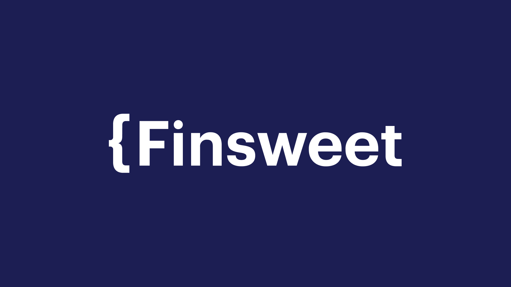

<h1>Codeboost Start - Finsweet</h1>
<h2> Projeto para o curso Codeboost Start. </h2>

PT - O Projeto Finsweet é um dos módulos do curso de Front-end do Codeboost Start. Nesse módulo utilizamos HTML | CSS | JAVASCRIPT.   EN - The  Project Finsweet is one of de modules of Codeboost Start's Front-end course. We have learnt about HTML | CSS | JAVASCRIPT.

